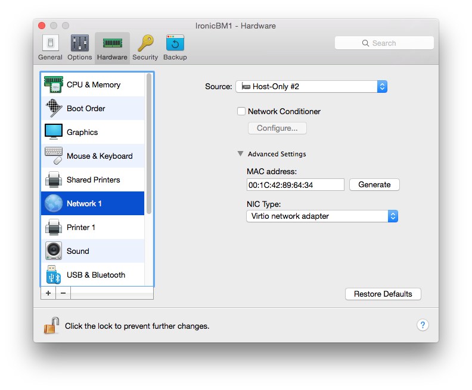

# Dockerstack

OpenStack services running inside containers. Ironic demo included.

**Status**
* 

## A picture is worth a thousand words

## Prerequisites

 * [Docker](https://www.docker.com) 1.6.0 or later

 * [docker-py](https://github.com/docker/docker-py) version 1.2.3 on the ansible server running the playbook
 * [MySQL-python](https://pypi.python.org/pypi/MySQL-python) on the ansible server running the playbook
 * OpenStack python clients for Keystone, Glance, Neutron, Swift, Ironic and Nova on the ansible server running the playbook

        pip install python-{keystone,neutron,ironic,nova,glance,swift,openstack}client docker-py==1.2.3 MySQL-python

If you are using an Ubuntu box, above requirements require in turn:

    apt-get install libmysqlclient-dev libxml2-dev libxslt1-dev

If you are going to build the containers behind a proxy (_not recommended_), you will have to tweak both the Docker default configuration file and the os-base-image Dockerfile. [Here](http://nknu.net/running-docker-behind-a-proxy-on-ubuntu-14-04/) is a good guide about that.

## Clean

    # Clean version 1.0 with 5 parallel processes
    make clean -j5 BUILD_VERSION=1.0

## Test

Testing requires [shellcheck](http://www.shellcheck.net/about.html) 1.3.8 or later.

    # Test version 1.0 with 5 parallel processes
    make test -j5 BUILD_VERSION=1.0

### Example output

    (davide:marley)-[0]-(~/D/openstack-docker) # make test
    ☝️  os-mysql:latest - Not implemented
    ☝️  os-httpboot:latest - Not implemented
    ☝️  os-tftpboot:latest - Not implemented
    ☝️  os-rabbitmq:latest - Not implemented
    ☝️  os-memcached:latest - Not implemented
    ✅  os-keystone:latest - Passed
    ✅  os-glance-registry:latest - Passed
    ✅  os-glance-api:latest - Passed
    ✅  os-neutron-server:latest - Passed
    ✅  os-nova-conductor:latest - Passed
    ✅  os-nova-api:latest - Passed
    ✅  os-nova-scheduler:latest - Passed
    ✅  os-nova-compute:latest - Passed
    ✅  os-neutron-dhcp-agent:latest - Passed
    ✅  os-ironic-conductor:latest - Passed
    ✅  os-ironic-api:latest - Passed
    ✅  os-swift-proxy:latest - Passed
    ✅  os-swift-account:latest - Passed
    ✅  os-swift-object:latest - Passed
    ✅  os-swift-container:latest - Passed
    ☝️  os-base-image:latest - Not implemented

## Build

    # Build "latest"
    make all

    # Build version 1.0
    make all BUILD_VERSION=1.0

### Example output

    (davide:marley)-[0]-(~/D/openstack-docker) # make all
    🔨  os-base-image:latest - Done
    🔨  os-mysql:latest - Done
    🔨  os-httpboot:latest - Done
    🔨  os-tftpboot:latest - Done
    🔨  os-rabbitmq:latest - Done
    🔨  os-memcached:latest - Done
    🔨  os-keystone:latest - Done
    🔨  os-glance-registry:latest - Done
    🔨  os-glance-api:latest - Done
    🔨  os-neutron-server:latest - Done
    🔨  os-nova-conductor:latest - Done
    🔨  os-nova-api:latest - Done
    🔨  os-nova-scheduler:latest - Done
    🔨  os-nova-compute:latest - Done
    🔨  os-neutron-dhcp-agent:latest - Done
    🔨  os-ironic-conductor:latest - Done
    🔨  os-ironic-api:latest - Done
    🔨  os-swift-proxy:latest - Done
    🔨  os-swift-account:latest - Done
    🔨  os-swift-object:latest - Done
    🔨  os-swift-container:latest - Done

## Run the demos

### Please note
Please keep in mind that the "interesting" things here are the Dockerfiles, not the demos. The two demos show just two possible ways to use container images that are built with the previous command and they are very dependent on the hardware I used to develop them.

Also, in a production environment you may want to distribute your containers on multiple servers and use an external DNS server keeping track of the needed aliases ("service names" -> docker server). You may want to use a DNS service with an API service orchestrated with Ansible, for instance.

The included Ansible playbook also creates a number of data containers to demonstrate how data can be persisted across upgrades while preserving portability.

Both demos use [autodns](https://github.com/rehabstudio/docker-autodns) from rehabstudio. This is not a strict requirement for the proposed infrastructure so you can use your preferred DNS, as long as it can be configured dynamically during the creation of containers.
Using Ansible to configure an external DNS or even using Avahi daemon are possible alternatives.
For the sake of these demos, as described [here](https://github.com/rehabstudio/docker-autodns#prerequisites), the docker daemon should be started with the following parameters:

        DOCKER_OPTS="--bip=172.17.42.1/16 --dns=172.17.42.1 --dns=<your resolver1> [--dns=<your resolver2> [...]]"

 Add `nameserver 127.0.0.1` on top of the resolv.conf file running the docker server.

__Run the Ironic demo:__

This demo consists of an Ansible playbook and 2 shell scripts. It is designed for Parallels Desktop and requires an unprovisioned virtual machine with one NIC with MAC address `00:1C:42:89:64:34`.

1. Run `ansible-playbook`:

        ~# cd ansible
        ~# time ansible-playbook -i inventory/docker_server ironic.yml

        [...]

        TASK: [Waiting for Glance API to become available] ****************************
        ok: [docker-server.local]

        TASK: [Get temp-url-key for the service tenant] *******************************
        ok: [docker-server.local]

        TASK: [Set temp-url-key for the service tenant] *******************************
        changed: [docker-server.local]

        PLAY RECAP ********************************************************************
        docker-server.local        : ok=61   changed=37   unreachable=0    failed=0   

        real	2m16.800s
        user	0m2.986s
        sys	0m2.249s

 After a successful play, you should have the following list of containers (output of `docker ps -a`, edited):

        IMAGE                   PORTS                      NAMES
        os-glance-api           0.0.0.0:9292->9292/tcp     glance-api.os-in-a-box
        os-glance-registry      9191/tcp                   glance-registry.os-in-a-box
        os-swift-proxy          0.0.0.0:8080->8080/tcp     swift-proxy.os-in-a-box
        os-swift-object         6000/tcp                   swift-object.os-in-a-box
        os-swift-container      6001/tcp                   swift-container.os-in-a-box
        os-swift-account        6002/tcp                   swift-account.os-in-a-box
        os-base-image                                      swift-devs-data
        os-base-image                                      swift-rings-data
        os-nova-compute                                    nova-compute.os-in-a-box
        os-nova-scheduler                                  nova-scheduler.os-in-a-box
        os-nova-api             0.0.0.0:8774->8774/tcp     nova-api.os-in-a-box
        os-nova-conductor                                  nova-conductor.os-in-a-box
        os-neutron-dhcp-agent                              neutron-dhcp-agent.os-in-a-box
        os-neutron-server       0.0.0.0:9696->9696/tcp     neutron-server.os-in-a-box
        os-ironic-api           0.0.0.0:6385->6385/tcp     ironic-api.os-in-a-box
        os-ironic-conductor                                ironic-conductor.os-in-a-box
        os-httpboot             0.0.0.0:8090->80/tcp       ipxe-httpd.os-in-a-box
        os-tftpboot             0.0.0.0:69->69/udp         pxe-tftp.os-in-a-box
        os-base-image                                      pxe-boot-data
        os-rabbitmq             5672/tcp                   rabbitmq.os-in-a-box
        os-keystone             0.0.0.0:5000->5000/tcp,    keystone.os-in-a-box
                                0.0.0.0:35357->35357/tcp
        os-mysql                3306/tcp                   mysql.os-in-a-box
        os-base-image                                      mysql-data
        os-memcached            11211/tcp                  memcached.os-in-a-box
        rehabstudio/autodns     0.0.0.0:53->53/udp         autodns.os-in-a-box

2. run `scripts/connect_external_net.sh` to attach `eth1` (an external physical interface) to the provisioning network.
Among other things, this script creates a virtual switch and a couple of veth interfaces for each container that needs that. Il also "pushes" one of the 2 veth interface in the corresponding container.

 The following picture shows the final (virtual) networking configuration after running `scripts/connect_external_net.sh`:

        ┌──────────────────────────────────────────────────┐   ┌─┐ ┌───────┐
        │ ┌────────────────────────────────────────────┐   │   │ │─│BM node│
        │ │                  docker0                   │   │   │p│ └───────┘
        │ └────────────────────────────────────────────┘   │   │h│          
        │           │                       │              │   │y│          
        │           │                       │              │   │s│          
        │┌────────────────────┐    ┌────────────────┐      │   │i│ ┌───────┐
        ││ Neutron DHCP Agent │    │ ┌──────────────┴─┐    │   │c│─│BM node│
        ││     Container      │    │ │ ┌──────────────┴─┐  │   │a│ └───────┘
        ││┌──────────────────┐│    │ │ │ ┌──────────────┴─┐│   │l│          
        │││      br-ex┌────┐ ││    │ │ │ │Other containers││   │-│          
        ││└───────────┤ext1├─┘│    └─┤ │ │                ││   │n│          
        ││            └────┘  │      └─┤ │                ││   │e│          
        ││               │    │        └─┤                ││   │t│          
        │└───────────────┼────┘          └────────────────┘│   │w│          
        │                │                                 │   │o│          
        │             ┌────┐      ┌───────────────┐     ┌──┴─┐ │r│ ┌───────┐
        │             │ext0│──────│ provisioning  │─────│eth1│─│k│─│BM node│
        │     ┌────┐  └────┘      └───────────────┘     └──┬─┘ │ │ └───────┘
        └─────┤eth0├───────────────────────────────────────┘   └─┘          
              └────┘                                                        

3. run `scripts/setup_ironic.sh` to create the initial demo setup for BM provisioning.

4. boot a new instance

        nova boot --flavor ParallelsVM --image "Ubuntu Vivid - x86_64" --config-drive yes --key-name keyp1  i-am-a-bm-node

5. enjoy! :)

__Run the OpenStack demo:__

1. Run `ansible-playbook`:

        ~# cd ansible
        ~# time ansible-playbook -i inventory/docker_server openstack.yml

        [...]

        TASK: [Waiting for Glance API to become available] ****************************
        ok: [docker-server.local]

        TASK: [Get temp-url-key for the service tenant] *******************************
        ok: [docker-server.local]

        TASK: [Set temp-url-key for the service tenant] *******************************
        changed: [docker-server.local]

        PLAY RECAP ********************************************************************
        docker-server.local        : ok=61   changed=37   unreachable=0    failed=0   

        real	2m16.800s
        user	0m2.986s
        sys	0m2.249s

 After a successful play, you should have the following list of containers (output of `docker ps -a`, edited):

        IMAGE                   PORTS                      NAMES
        92b7f8095a35            0.0.0.0:9292->9292/tcp     glance-api.os-in-a-box
        5c98791505b6                                       glance-data
        47ef697569d3            9191/tcp                   glance-registry.os-in-a-box
        35f6d080de31                                       nova-compute.os-in-a-box
        3a984a5f499d                                       compute-data
        0f15e53c1cf4                                       nova-scheduler.os-in-a-box
        e7e7610647d8            0.0.0.0:8774->8774/tcp     nova-api.os-in-a-box
        60c445806f7e                                       nova-conductor.os-in-a-box
        b0ef9745fb65                                       neutron-l3-agent.os-in-a-box
        1b337a5a4146                                       neutron-dhcp-agent.os-in-a-box
        03cd558c751a            0.0.0.0:9696->9696/tcp     neutron-server.os-in-a-box
        1a061398b117            5672/tcp                   rabbitmq.os-in-a-box
        4854824d7c4a            0.0.0.0:5000->5000/tcp     keystone.os-in-a-box
                                0.0.0.0:35357->35357/tcp
        01c4ebce078c            3306/tcp                   mysql.os-in-a-box
        26c1dc3a1ba2                                       mysql-data
        8ef12bc5af8a            11211/tcp                  memcached.os-in-a-box
        719ef6ad3353            0.0.0.0:53->53/udp         autodns.os-in-a-box

2. run `scripts/connect_external_net.sh` to attach `eth1` (an external physical interface) to the provisioning network.
Among other things, this script creates a virtual switch and a couple of veth interfaces for each container that needs that. Il also "pushes" one of the 2 veth interface in the corresponding container.

 The following picture shows the final (virtual) networking configuration after running `scripts/connect_external_net.sh`:

        ┌──────────────────────────────────────────────────┐   ┌─┐
        │ ┌────────────────────────────────────────────┐   │   │ │
        │ │                  docker0                   │   │   │e│
        │ └────────────────────────────────────────────┘   │   │x│
        │           │                       │              │   │t│
        │           │                       │              │   │e│
        │┌────────────────────┐    ┌────────────────┐      │   │r│
        ││ Neutron DHCP Agent │    │ ┌──────────────┴─┐    │   │n│
        ||  Neutron L3 Agent  |    | | ┌──────────────┴─┐  |   |a|
        ||    Nova compute    |    | | | ┌──────────────┴─┐|   |l|
        ││     Containers     │    │ │ | |                ||   │ │
        ││┌──────────────────┐│    │ │ │ │                ||   │-│
        │││      br-ex┌────┐ ││    │ │ │ │Other containers││   │ │
        ││└───────────┤ext1├─┘│    └─┤ │ │                ││   │n│
        ││            └────┘  │      └─┤ │                ││   │e│
        ││               │    │        └─┤                ││   │t│
        │└───────────────┼────┘          └────────────────┘│   │w│
        │                │                                 │   │o│
        │             ┌────┐      ┌───────────────┐     ┌──┴─┐ │r│
        │             │ext0│──────│ provisioning  │─────│eth1│─│k│
        │     ┌────┐  └────┘      └───────────────┘     └──┬─┘ │ │
        └─────┤eth0├───────────────────────────────────────┘   └─┘
              └────┘

3. run `scripts/setup_openstack.sh` to create the initial demo setup.

4. boot a new instance

        nova boot --flavor m1.small --image "Cirros 0.3.4 - x86_64" --config-drive yes i-am-a-vm

5. enjoy! :)
