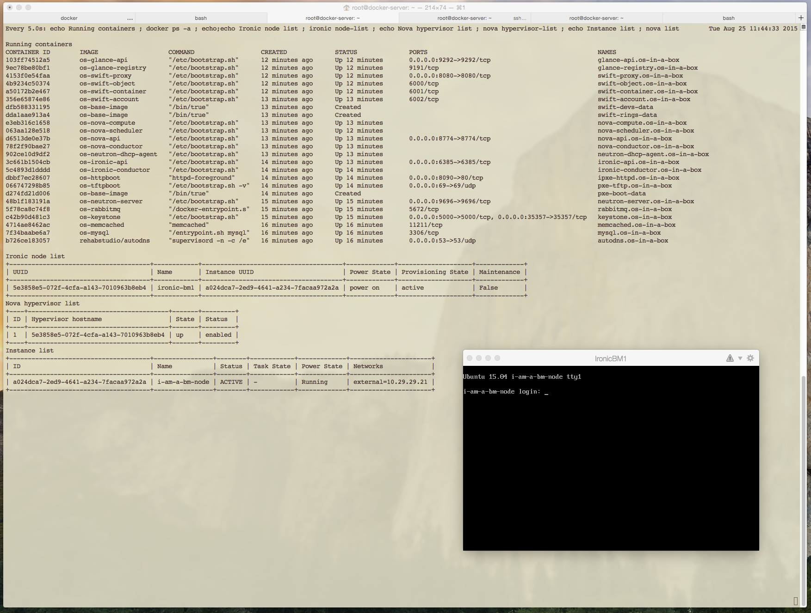

## A picture is worth a thousand words

## Prerequisites

 * [Docker](https://www.docker.com) 1.6.0 or later

 * [docker-py](https://github.com/docker/docker-py) version 1.2.3 on the ansible server running the playbook
 * [MySQL-python](https://pypi.python.org/pypi/MySQL-python) on the ansible server running the playbook
 * OpenStack python clients for Keystone, Glance, Neutron, Swift, Ironic and Nova on the ansible server running the playbook

    pip install python-{keystone,neutron,ironic,nova,glance,swift}client docker-py==1.2.3 MySQL-python
 
If you are using an Ubuntu box, above requirements require in turn:

    apt-get install libmysqlclient-dev libxml2-dev libxslt1-dev

 * Testing requires [shellcheck](http://www.shellcheck.net/about.html) 1.3.8 or later.

If you are going to build the containers behind a proxy (not recommended), you will have to tweak both the Docker default configuration file and the os-base-image Dockerfile. [Here](http://nknu.net/running-docker-behind-a-proxy-on-ubuntu-14-04/) is a good guide about that.

## Clean

    # Clean version 1.0 with 5 parallel processes
    make clean -j5 BUILD_VERSION=1.0

## Test

    # Test version 1.0 with 5 parallel processes
    make test -j5 BUILD_VERSION=1.0

### Example output

    (davide:marley)-[0]-(~/D/openstack-docker) # make test
    ☝️  os-mysql:latest - Not implemented
    ☝️  os-httpboot:latest - Not implemented
    ☝️  os-tftpboot:latest - Not implemented
    ☝️  os-rabbitmq:latest - Not implemented
    ☝️  os-memcached:latest - Not implemented
    ✅  os-keystone:latest - Passed
    ✅  os-glance-registry:latest - Passed
    ✅  os-glance-api:latest - Passed
    ✅  os-neutron-server:latest - Passed
    ✅  os-nova-conductor:latest - Passed
    ✅  os-nova-api:latest - Passed
    ✅  os-nova-scheduler:latest - Passed
    ✅  os-nova-compute:latest - Passed
    ✅  os-neutron-dhcp-agent:latest - Passed
    ✅  os-ironic-conductor:latest - Passed
    ✅  os-ironic-api:latest - Passed
    ✅  os-swift-proxy:latest - Passed
    ✅  os-swift-account:latest - Passed
    ✅  os-swift-object:latest - Passed
    ✅  os-swift-container:latest - Passed
    ☝️  os-base-image:latest - Not implemented

## Build

    # Build "latest"  (docker caches FS layers, so don't use parallel builds)
    make all

    # Build version 1.0
    make all BUILD_VERSION=1.0

### Example output

    (davide:marley)-[0]-(~/D/openstack-docker) # make test all
    ☝️  os-mysql:latest - Not implemented
    ☝️  os-httpboot:latest - Not implemented
    ☝️  os-tftpboot:latest - Not implemented
    ☝️  os-rabbitmq:latest - Not implemented
    ☝️  os-memcached:latest - Not implemented
    ✅  os-keystone:latest - Passed
    ✅  os-glance-registry:latest - Passed
    ✅  os-glance-api:latest - Passed
    ✅  os-neutron-server:latest - Passed
    ✅  os-nova-conductor:latest - Passed
    ✅  os-nova-api:latest - Passed
    ✅  os-nova-scheduler:latest - Passed
    ✅  os-nova-compute:latest - Passed
    ✅  os-neutron-dhcp-agent:latest - Passed
    ✅  os-ironic-conductor:latest - Passed
    ✅  os-ironic-api:latest - Passed
    ✅  os-swift-proxy:latest - Passed
    ✅  os-swift-account:latest - Passed
    ✅  os-swift-object:latest - Passed
    ✅  os-swift-container:latest - Passed
    ☝️  os-base-image:latest - Not implemented
    🔨  os-base-image:latest - Done
    🔨  os-mysql:latest - Done
    🔨  os-httpboot:latest - Done
    🔨  os-tftpboot:latest - Done
    🔨  os-rabbitmq:latest - Done
    🔨  os-memcached:latest - Done
    🔨  os-keystone:latest - Done
    🔨  os-glance-registry:latest - Done
    🔨  os-glance-api:latest - Done
    🔨  os-neutron-server:latest - Done
    🔨  os-nova-conductor:latest - Done
    🔨  os-nova-api:latest - Done
    🔨  os-nova-scheduler:latest - Done
    🔨  os-nova-compute:latest - Done
    🔨  os-neutron-dhcp-agent:latest - Done
    🔨  os-ironic-conductor:latest - Done
    🔨  os-ironic-api:latest - Done
    🔨  os-swift-proxy:latest - Done
    🔨  os-swift-account:latest - Done
    🔨  os-swift-object:latest - Done
    🔨  os-swift-container:latest - Done

## Run the demo

The included demo depends on [autodns](https://github.com/rehabstudio/docker-autodns) from rehabstudio. This is not a strict requirement for the proposed infrastructure so you can use your preferred DNS, as long as it can be configured during the creation of containers. Using Ansible to configure an external DNS or even using Avahi daemon are possible alternatives.

For the sake of this demo, as described [here](https://github.com/rehabstudio/docker-autodns#prerequisites), the docker daemon should be started with the following parameters:

    DOCKER_OPTS="--bip=172.17.42.1/16 --dns=172.17.42.1 --dns=<your resolver1> [--dns=<your resolver2> [...]]"

Add `nameserver 127.0.0.1` on top of the resolv.conf file running the docker server.

Run `ansible-playbook`:

    (davide:marley)-[0]-(~/D/openstack-docker) # cd ansible
    (davide:marley)-[0]-(~/D/openstack-docker) # time ansible-playbook -i inventory/docker_server site.yml

Then run `scripts/connect_external_net.sh` to attach eth1 (an external physical interface) to the provisioning network.
This also creates a virtual switch and a couple of veth interfaces. Il also "pushes" one of the 2 veth interface in the `neutron-dhcp-agent` container.

This is the final (virtual) networking configuration

    ┌────────────────────────────────────────────────────────────┐      ┌─┐
    │┌──────────────────────────────────────────────────────────┐│      │ │   ┌────────┐
    ││                         docker0                          ││      │p│───│BM node │
    │└──────────────────────────────────────────────────────────┘│      │h│   └────────┘
    │             │                           │                  │      │y│
    │             │                           │                  │      │s│
    │┌─────────────────────────┐              │                  │      │i│
    ││   Neutron DHCP Agent    │    ┌──────────────────┐         │      │c│   ┌────────┐
    ││        Container        │    │ ┌────────────────┴─┐       │      │a│───│BM node │
    ││                         │    │ │ ┌────────────────┴─┐     │      │l│   └────────┘
    ││ ┌──────────────────────┐│    │ │ │ ┌────────────────┴─┐   │      │-│
    ││ │        br-ex  ┌────┐ ││    │ │ │ │ Other containers │   │      │n│
    ││ └───────────────┤ext1├─┘│    └─┤ │ │                  │   │      │e│
    ││                 └────┘  │      └─┤ │                  │   │      │t│
    ││                    │    │        └─┤                  │   │      │w│
    │└────────────────────┼────┘          └──────────────────┘   │      │o│
    │                     │                                      │      │r│
    │                  ┌────┐        ┌───────────────┐         ┌─┴──┐   │k│   ┌────────┐
    │                  │ext0│────────│ provisioning  │─────────│eth1│───│ │───│BM node │
    │        ┌────┐    └────┘        └───────────────┘         └─┬──┘   │ │   └────────┘
    └────────┤eth0├──────────────────────────────────────────────┘      └─┘
             └────┘

Lastly run `scripts/setup_openstack.sh` to create the initial demo setup for BM provisioning.
